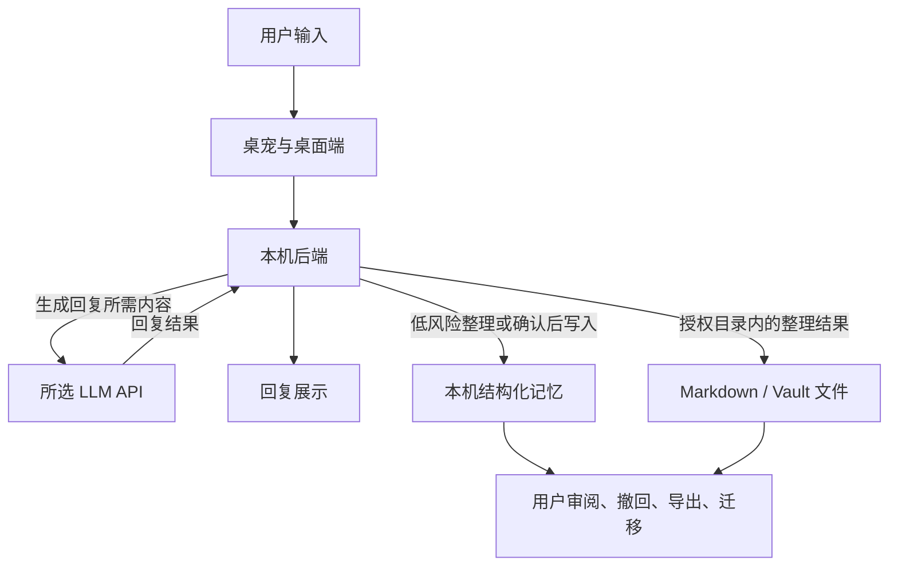

# 桌宠伙伴

定位声明：本项目保留 `Agent Pet` / `agent-pet` 命名；它是以桌宠为入口的长期记忆陪伴体，不是 AI coding agent 监控或评测桌面工具。

Agent Pet 想解决的不是“把聊天窗口搬到桌面上”，而是让用户清楚地知道：

- 它记住了什么。
- 为什么记住。
- 这些记忆来自哪一次聊天或整理。
- 用户能怎样查看、修改、撤回和带走这些记忆。

当前主叙事是：**记忆透明可控 + 跨工具可迁移**。桌宠负责陪你自然说话；记忆系统负责把值得保留的内容沉淀成可检查、可撤回、可导出的结构化记忆。知识整理、提醒、资料归档、复盘报告和调试诊断都是支撑能力，不是首屏主卖点。

## 产品体验

- 陪伴入口：从桌宠开始聊天，不要求用户先理解工作流、知识库或调试面板。
- 透明记忆：记忆页展示内容、来源、原因、风险、可信度和状态。
- 可控撤回：低风险自动整理要留下活动记录；可逆写入可以撤回，高风险内容必须确认。
- 可迁移：记忆和整理结果优先落成 SQLite 状态与 Markdown/Vault 文件，方便用户审阅、备份或迁移到 Obsidian 等工具。
- 支撑能力降级：提醒、资料整理、Wiki、报告和诊断保留，但应作为二级能力服务陪伴闭环。

## 数据流向说明

使用远程或兼容 OpenAI 的模型服务时，对话内容会发送到用户选择的 LLM API，用于生成回复或执行模型能力。保存在本机的是结构化记忆、活动记录、索引状态和用户授权目录中的 Markdown/Vault 衍生内容；这并不表示原始对话只在本机处理。

隐私边界必须按真实能力描述：如果配置的是云端模型，普通对话请求会离开本机；开启“本地隐私模式”后，被敏感策略命中的输入只做本机关键词检索，不发送到模型 API，代价是回复会更保守、智能程度会下降。

## 模块

- `apps/backend`：本机后端，负责接口、SQLite、检索、记忆、任务、资料整理和活动记录。
- `apps/desktop`：Electron + React 桌面端，负责桌宠、陪伴入口、聊天、记忆页和设置。
- `docs`：运行手册、验收边界、验证政策和历史记录。

## 当前验证边界

- 当前版本标记为 `0.0.1-alpha`；后端 Python 包元数据为 `0.0.1a0`。
- 阶段 1 的真实 Vault 聊天、记忆、回滚和部分 Electron 人工验收仍未补齐，跳过记录不是完成证据。
- 2026-06-19 用户手工验证确认：真实桌宠入口里“双击 Pet 窗口打开主舞台”可以成功执行。该项以用户人工确认为验收证据，按用户决定跳过录屏文件。

## 文档

- 当前文档入口见 [`docs/README.md`](docs/README.md)。
- 当前生效规格见 [`docs/current-specification.md`](docs/current-specification.md)。
- 验证层级政策见 [`docs/verification-policy.md`](docs/verification-policy.md)。
- 旧规格已归档到 [`docs/archive/Development_Documentation.md`](docs/archive/Development_Documentation.md)，仅作历史参考。
- 协调进度记录见 [`progress.md`](progress.md)。
