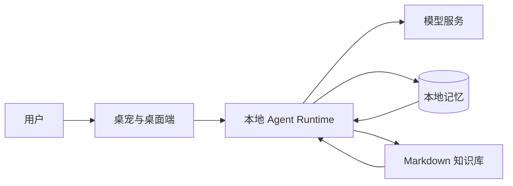

# Agent Pet

[](https://github.com/gitagin/agentpet/actions/workflows/ci.yml)


一个以长期记忆为核心的桌面 AI 伙伴。

Agent Pet 将桌宠交互、本地记忆、知识检索和自动整理放在同一个桌面应用中。用户可以像使用普通聊天助手一样与它交流，同时保留对长期记忆和本地数据的控制权。

<p align="center">
  
</p>

## 项目定位

大多数聊天应用把历史消息留在对话列表里，但对“哪些内容应该成为长期记忆”缺少清晰的处理方式。Agent Pet 将这部分能力拆成独立的记忆系统：

- 对话中的即时理解只服务当前交流；
- 适合长期保留的信息经过整理后进入结构化记忆；
- 记忆保留来源、状态和可追踪的处理记录；
- 用户可以查看、修正、撤回或重置这些内容。

对话是入口，记忆是主线。任务提醒、资料整理和多 Agent 协作都围绕这条主线提供支持。

## 核心能力

### 桌面陪伴

桌宠常驻桌面，通过紧凑气泡和主舞台承载不同深度的交互。主界面包含聊天、记忆、计划和设置等页面，兼顾日常陪伴与信息管理。

### 长期记忆

记忆系统区分当前会话中的即时理解和可持续使用的慢速记忆。长期内容包含来源、置信度、生命周期和召回权限，减少临时情绪、玩笑或过期信息对后续对话的干扰。

### 本地知识检索

SQLite FTS5 与 Markdown Vault 构成本地检索主路径。回答可以关联本地来源，Markdown 内容也可以继续使用 Obsidian 等工具查看和维护。

### 可控的自动整理

低风险内容可以自动归档为日记、结构化记忆或资料页，同时写入活动记录。可逆的 Markdown 写入保存回滚信息；需要确认的操作不会由模型直接执行。

### 任务与连续性

应用支持持久化任务、提醒恢复和桌面通知。记忆、任务和最近活动共同构成连续性上下文，让桌宠能够围绕真实状态继续交流。

### 多 Agent 协作

复杂请求可以进入有边界的多角色流程，完成检索、分析、审阅和结果整合。简单聊天保留轻量路径，避免所有请求都承担同样的编排成本。

## 使用方式

在完成项目依赖安装后，进入桌面端目录运行：

```bash
cd apps/desktop
npm run dev
```

首次使用时，在设置页面配置兼容的模型服务、模型名称和 API key，即可开始聊天。

设置中同时提供模型连接测试、隐私模式、自动整理选项和记忆重置。重置记忆不会删除已经保存的模型连接配置。

## 工作方式



桌面端负责交互和状态呈现，本地后端负责记忆、检索、任务、Agent 编排与数据写入。模型服务由用户自行配置，SQLite 和 Markdown 保存长期使用的数据。

## 设计重点

### 数据归属清晰

结构化状态保存在 SQLite，可迁移内容保存在 Markdown。向量或图索引属于可重建的加速层，不替代用户可以直接检查的数据源。

### 模型与执行分离

模型负责理解、检索、分析和生成结构化建议。权限判断、实际写入、幂等控制和活动记录由确定性组件处理，避免把副作用完全交给模型。

### 写入过程可追踪

自动整理会记录来源、风险、目标、状态和可撤回性。用户看到的不只是最终结果，也包括内容如何进入本地记忆的过程。

### 桌面权限隔离

Electron Renderer 只通过受控 IPC 使用桌面能力，不直接访问 Node、文件系统或本地会话凭据。后端服务只面向本机运行。

## 技术架构

| 模块 | 技术 |
| --- | --- |
| Desktop | Electron、React、TypeScript、Vite |
| Backend | FastAPI、Pydantic、Uvicorn |
| Agent Runtime | LangGraph、LangChain |
| Storage | SQLite、FTS5、Markdown Vault |
| Scheduling | APScheduler、SQLAlchemy |
| Retrieval Extensions | Qdrant、Kuzu |

项目采用桌面端与本地 sidecar 分离的结构。Electron 负责窗口、桌宠和系统集成，FastAPI 后端负责业务能力，两者通过受控的本机接口连接。

## 目录结构

```text
agentpet/
├─ apps/
│  ├─ desktop/          # Electron + React 桌面端
│  └─ backend/          # FastAPI、Agent、记忆与检索服务
├─ docs/                # 架构与项目文档
└─ scripts/             # 开发和验证脚本
```

## 当前方向

Agent Pet 仍在持续迭代。目前的重点是让桌宠交互、长期记忆和本地资料形成稳定的使用闭环，并继续改善记忆质量、交互体验和桌面端表现。
