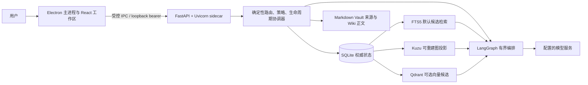

# Agent Pet

[](https://github.com/gitagin/agentpet/actions/workflows/ci.yml)


> **本地个人 LLM Wiki 与记忆图谱**：把个人对话、来源、事实、关系和决策放进一个可以检查、纠正和忘记的 Windows 桌面工作区。

## 先给结论

Agent Pet 不是把一个聊天输入框包在模型 API 外面就结束的项目，但**普通聊天快路径确实接近模型直连**。只演示“问一句、答一句”时，它看起来就像 API 套壳，这条路径本身不是项目价值。项目的可交付价值在于一条持久化闭环：

```text
来源/对话 -> 候选 -> 用户确认 -> 实体/事实/关系 -> Wiki 页面
      -> 新会话召回与引用 -> 用户纠正/忘记 -> 旧事实退出回答上下文
```

当前产品是本地单用户 MVP，不提供团队知识库、云端服务或企业租户。2026-08-14 的 action、跨重启记忆闭环和 source-to-decision Wiki 三条隔离 L3 旅程已通过；全副作用统一、24 小时稳定性、7 天真实使用、干净 Windows 机器和完整视觉人工矩阵仍是证据缺口。冻结审计基线是 `57/100`，最近一次独立整档复评分仍是 2026-08-11 的 `62/100`；不能把新测试数量或目标分预先写成业务提升。

## 解决什么问题

个人在长期项目中反复遇到四个具体问题：

1. **重复解释**：上下文留在旧会话里，新会话仍要重新说明项目背景、偏好和边界。
2. **记忆不可信**：模型可能把玩笑、临时状态或错误推断当成长期事实，用户看不到来源，也很难撤回。
3. **知识分散**：聊天、Markdown 笔记和决策记录互相脱节，找到答案时无法快速回到原始证据。
4. **自动写入不可控**：模型生成的任务、提醒或页面如果直接执行，网络重试或进程崩溃可能留下未知状态或重复副作用。

Agent Pet 用“可审计的本地记忆工作流”解决这些问题：模型提出候选和查询计划，确定性代码决定权限、生命周期、写入、回读和恢复；用户始终可以看证据链、纠正或忘记。

## 谁在使用，怎样使用

### 外部个人用户

目标用户是 Windows 上管理个人项目、资料和决策的知识工作者。典型使用方式：

1. 启动桌面应用，在设置中配置兼容的模型服务；数据目录和 Vault 保持在本机。
2. 直接聊天，或导入一份本地来源。输入“请记住……”时，系统先生成候选，不把任意通用事实自动升级为长期记忆。
3. 在记忆工作区查看实体、事实、关系、原始来源、Wiki 绑定和生命周期；低风险明确声明可确认，含糊或敏感内容停在待确认/隔离状态。
4. 新会话询问同一主题。系统优先使用有召回权限且有证据的事实，回答带来源；没有 evidence 时明确说找不到，不编造答案。
5. 发现错误时执行纠正或忘记。纠正生成新事实并使旧事实 `superseded`，忘记会撤销召回权限；随后再问一次验证旧内容不再进入上下文。

### 公司内部单员工试点

内部使用只指**一名员工的本地试点**，不是团队协作功能。为试点创建隔离的 SQLite/Vault，先登记固定任务的基线（查找耗时、重复说明次数、引用覆盖和错误记忆反馈），连续使用 7 个日历日，再导出只含哈希、计数和分母的匿名聚合。样本不足时报告“证据不足”，不把个人结果外推成公司效率提升。

## 一条可复验主旅程

下面的旅程同时展示成功和失败，演示不能只截取成功画面：

| 步骤 | 用户看到的结果 | 解决的问题 | 失败时的下一步 |
| --- | --- | --- | --- |
| 输入或导入来源 | 原文保存为不可变来源并计算 hash | 保留可追溯证据 | 来源解析失败时保留原文件，改用手工导入 |
| 候选抽取 | 实体/事实/关系候选，带置信度、风险和 evidence | 降低“模型随口记住”的风险 | 非法结构化输出变为 `candidate_failed`，重试抽取，不写入权威事实 |
| 确认/激活 | 用户确认后才获得召回权限 | 把用户意图和模型建议分开 | 冲突或敏感候选隔离，查看双方来源后再决定 |
| Wiki/图谱派生 | 按页面类型生成正文，图谱显示受控关系 | 让知识可读、可连接、可复用 | lint 或写入冲突停止该页面，保留 snapshot 和恢复入口 |
| 新会话召回 | 一至二跳证据摘要和引用进入 prompt | 减少重复解释并能回到原文 | 无 evidence 或 Kuzu 降级时使用 SQLite/FTS，明确提示范围 |
| 纠正/忘记 | 新事实 supersedes 旧事实，或撤销旧事实权限 | 错误不会永久污染后续回答 | 权威读回不唯一时进入 `failed_recovery`，不重放副作用 |

## 为什么需要 AI

不用 AI 也能做表单、SQLite、FTS 和 Markdown；这些确定性部分正是系统的安全底座。AI 只在规则难以覆盖的非确定性工作中提供净价值：

- 从自然语言中识别“这是偏好、边界、事件还是决策”；
- 给同名人物、项目和概念提出消歧建议；
- 把用户问题规划为有界的一至二跳证据查询；
- 在多个有来源的事实之间生成可读综合，并显式标注不确定性。

权限、敏感策略、实体唯一性、状态迁移、claim/receipt、幂等、引用校验、删除和回滚不交给 AI。普通闲聊可以走单模型流式快路径；只有需要记忆或资料证据的请求才进入有界 LangGraph 流程（Orchestrator、每轮最多一个只读 Retrieval Agent、Synthesizer）。没有 Supervisor、无限 Agent 或并行专家群体。

## 为什么不用更简单的方案

- 只有聊天 API：能生成文本，但没有跨会话事实、来源、纠正和忘记的权威状态。
- 只有 SQLite + 表单：能保存字段，却难以处理自然语言抽取、同名实体消歧和多来源综合；AI 只补足这些语言工作，SQLite 仍负责裁决。
- 只有 Markdown 文件：用户可读但难以做生命周期、并发幂等和一至二跳授权遍历；因此 Markdown 保留正文，SQLite 保留结构化权威。
- 直接把 Kuzu 或向量库当主库：索引损坏或代次落后会污染回答；本项目把它们设计成可重建投影，并在每次返回前用 SQLite 重新授权。
- 无限 Agent 编排：增加等待、失败和副作用面，却不能证明价值；当前只保留一个顺序只读 Retrieval Agent，并给每轮设预算。

## 系统如何工作



权威归属只有两处：SQLite 保存实体、别名、事实/关系、evidence、生命周期、权限、动作 claim/receipt、指标事件和图投影代次；Markdown Vault 保存不可变来源和用户可读 Wiki 正文。FTS、Qdrant 和 Kuzu 都能删除并重建，不能反向决定事实是否有效。Kuzu 读取必须与 SQLite 的新鲜授权遍历相交；缺失、损坏或代次不一致时回退 SQLite，并在诊断状态中显示降级原因。当前 claim/receipt 证据只覆盖主要任务与 post-reply memory/Wiki 路径；memory feedback、profile、hygiene、retrospective 和 continuity proposal 仍有 direct mutation，不能写成所有副作用都已统一。

“LLM Wiki”描述的是来源到决策的生命周期，不是把普通 RAG 换一个名字；FTS、向量和图遍历仍是内部检索手段，回答必须遵守 evidence、生命周期和召回权限。

## 技术栈价值与边界

| 技术 | 在本项目中解决的具体问题 | 证据入口 | 边界，不能由它证明什么 |
| --- | --- | --- | --- |
| Electron | 托盘、自启开关、Windows 通知、sidecar 启停、preload 权限隔离 | `apps/desktop/electron/main.cjs`、`preload.cjs`、`sidecar.js` | 只验证 Windows 本地桌面；睡眠/关机期间不在线，也不是企业客户端 |
| React + TypeScript | 组织图谱/时间线/来源工作区、失败状态和交互状态；生成 API 类型减少前后端漂移 | `apps/desktop/src/views/MemoryWindowView.tsx`、`types.gen.ts` | typecheck 通过不等于真实可用性、键盘、DPI 或视觉验收通过 |
| `@xyflow/react` | 提供实体关系画布、选中边和证据链轨道的交互基础，避免自建第二套图库 | `apps/desktop/src/features/memory/MemoryGraphWorkspace.tsx` | 只负责展示与交互，不证明关系真实，也不决定召回权限 |
| Vite | Renderer 的开发服务器、测试入口和可重复构建 | `apps/desktop/package.json` | 构建工具，不是 Agent 能力或业务价值 |
| FastAPI + Pydantic | 本机 API 路由、输入校验、稳定错误码和 OpenAPI 契约 | `apps/backend/app/api/`、`models/api.py` | 本机单用户边界，不等于高并发服务 |
| Uvicorn | Electron 管理的 ASGI sidecar、健康探针和进程边界 | `apps/backend/app/sidecar_entry.py` | 本机启动 smoke 不代表云端可用性或全天在线 |
| LangChain | 统一模型、StructuredTool 和 OpenAI-compatible provider 适配 | `apps/backend/app/agents/` | 适配层不等于 Agent 自治；模型可能离线或输出非法结构 |
| LangGraph | 有状态路由、SSE 事件、有限轮次协作和 checkpoint 恢复 | `apps/backend/app/agents/graph_runtime.py` | 普通聊天可绕过；没有 Supervisor、无限 Agent 或并行专家 |
| SQLite | 权威实体、事实、evidence、生命周期、claim/receipt、提醒和本地指标 | `apps/backend/migrations/021_llm_wiki_memory_graph.sql`、`024_post_reply_jobs_and_evidence_idempotency.sql` | 单机数据库；不提供团队租户或跨设备同步 |
| SQLAlchemy | 为 APScheduler 提供持久化提醒 job store 和重启后的 catch-up 查询 | `apps/backend/app/services/`、`migrations/022_resident_runtime_delivery.sql` | 只承担本地调度持久化，不是分布式队列或通用 ORM 领域层 |
| Markdown Vault | 用户可读、可迁移的不可变来源和 Wiki 正文 | `apps/backend/app/services/wiki/`、`vault/Wiki/AGENTS.md` | 文件冲突需停写和恢复；不会自动解决外部编辑 |
| FTS5 | 无额外服务的全文召回和模型/图降级 fallback | `apps/backend/app/services/retrieval.py` | 词法匹配，不是语义正确率证明 |
| Kuzu | 从 SQLite 重建的一至二跳关系遍历加速和图查询实验 | `apps/backend/app/services/memory_graph_kuzu.py` | 只读派生投影；损坏时必须回退 SQLite，不是第二事实来源 |
| Qdrant | 可选向量候选和规模/延迟实验 | `apps/backend/app/evals/vector_query_scaling.py` | 未通过质量晋升评测前不作为默认路径，不能宣称 GraphRAG |
| APScheduler | 持久提醒、登录自启后的过期任务追赶和通知显示尝试记录 | `apps/backend/app/services/reminder_delivery.py`、`apps/desktop/electron/resident.js` | OS 权限拒绝、睡眠和关机需要用户重试；只证明显示尝试，不证明送达 |
| SSE | 流式 token、状态、引用、动作和恢复事件，让用户知道系统停在哪一步 | `apps/backend/app/agents/events.py`、`apps/backend/app/api/chat.py` | 改善等待和可解释性，不提高模型正确率，也不代替持久 receipt |

## 失败边界与用户动作

| 故障 | 系统必须做什么 | 用户可做什么 | 当前证据 |
| --- | --- | --- | --- |
| 模型离线/超时/限流 | 返回稳定错误码；不把失败写成记忆，保留本地浏览 | 使用 FTS/Wiki 浏览，修正模型设置后重试只读步骤 | `output/verification/LLMWIKI-013/faults/fault-matrix-report.md`：离线场景通过真实隔离 API，超时、限流和额度耗尽通过确定性 harness；真实 provider 质量活动尚未运行 |
| 没有 evidence | 返回“没有找到可引用来源”，不生成确定答案 | 提供来源或明确声明，再手工确认候选 | 同上：`no_evidence` Passed |
| 非法结构化输出 | 丢弃该候选，记录失败阶段，不执行写入 | 重试抽取或改为手工录入 | 确定性后端故障 harness 已通过；尚未用真实 provider API 注入复核 |
| 新旧事实冲突 | 两条事实并排为 `conflict`，限制进入回答上下文 | 查看两条来源，确认、纠正或忘记 | 确定性后端故障 harness 已通过冲突隔离；真实桌面交互仍待视觉人工门 |
| Markdown hash/版本冲突 | 停止目标页写入，保留 claim、snapshot 和 `failed_recovery` | 查看差异后重试或放弃 | 确定性后端故障 harness 已通过外部内容保留与 proposal pending |
| effect 后 receipt 前崩溃 | 恢复时权威读回；唯一匹配则返回原 receipt，不重复 adapter | 等恢复状态或打开本地恢复记录 | 确定性进程崩溃 harness 与 `test_production_action_recovery.py` 已通过；打包 Electron 路径未覆盖 |
| Kuzu 缺失/损坏 | SQLite 继续授权遍历，图页显示 degraded 原因 | 继续查询，稍后重建投影 | fault matrix `kuzu_missing_or_corrupt` Passed |
| sidecar 崩溃 | 有界重启并恢复健康；超过上限转人工重试 | 点击重试/查看日志；不把短时重启写成全天在线 | 后端重启已观测，Electron supervisor 路径 Partial |
| 通知权限拒绝 | 保留任务和 reminder，记录 `display_unknown`/失败 | 在任务页查看并手动重试通知 | OS 权限场景尚未运行 |
| 敏感内容 | 拒绝进入普通记忆/图投影；隐私模式只做本地检索 | 使用脱敏本地记录或放弃 | fault matrix `sensitive_content` Passed |

未知状态不会显示为成功。副作用发生后但回执未知时，用户看到的是恢复/人工复核入口，而不是“已完成”。

## 指标、业务意义与时间边界

### 已有可复算证据

固定合成语料 `agent-pet-retrieval-synthetic-v1.0.0` 共 60 个案例：可回答 50 个。当前 runner 调用生产 `app.evals.retrieval_eval`，FTS Recall@5 的宏平均分子为 `24.8/50 = 0.496`（阈值 `0.80`，`Failed`）；无证据准确率为 `10/10 = 1.00`（`Passed`），false activation 为 `0/10 = 0`（`Passed`）。这个检索边界不生成或评审答案，因此 citation coverage 是 `0/0`、`insufficient_sample`。SQLite 图、Kuzu 图和 Kuzu 缺失后的 SQLite fallback 在版本化合成夹具上各为 `21/21 Passed`，确定性图基线为 `37/37`；correction propagation 仅 `3/3`，低于最小样本 `20`，LLM 抽取/综合仍为 `not_run`。报告以退出码 `1` 保留 FTS 召回和样本缺口，见 `output/verification/LLMWIKI-011/eval-20260814/report.json`。

本机匿名指标服务定义了召回反馈、纠正传播、来源覆盖、重复动作、提醒显示尝试和恢复时间的分子/分母（`apps/backend/app/services/product_metrics.py`）。当前生产入口实际发出的是查找开始/完成、召回/无证据、反馈/纠正/忘记以及主要 action 的提交/副作用/重复事件；`candidate_created`、`activated`、`grounded_answer`、提醒显示、sidecar 健康、Wiki lint/reuse 和明确的上下文重复反馈尚未形成完整生产接线。因此相应聚合会显示 `0` 或 `insufficient_sample`，不能当成已经测得的来源覆盖、提醒送达或恢复时间。在至少 7 天试用完成前，只展示样本量和基线，不能写“效率提升 50%”或其他业务 uplift。

### 24 小时到底有什么意义

24 小时不是“模型一直在线”的宣传词。对这个本地产品，它验证的是登录态常驻、sidecar 有界重启、过期提醒追赶、claim/receipt 恢复、内存/句柄增长和图投影延迟是否在一个完整日夜中保持可控。电脑睡眠或关机时系统不在线，恢复后只能追赶持久任务；OS 通知只能证明 display attempt，不能证明用户看到。

当前有 20 次 sidecar 启停的本机 smoke；组合故障矩阵为 `15 Passed / 0 Failed / 3 Partial`，其中 4 项来自真实隔离 sidecar/API，11 项来自确定性后端故障 harness。3 个 Partial 是打包 Electron sidecar 崩溃路径、真实 Windows 睡眠恢复和 Windows 通知权限拒绝；runner 按契约返回退出码 `2`，不能按全门通过处理。它仍不是真实 24 小时 soak（1,440 个每分钟样本）或 7 天真实用户证据，所以只报告工程状态和样本量，不给出稳定性 SLO、留存或生产力结论。

### 评分基线（冻结审计）

| 维度 | 基线 | 扣分原因 |
| --- | ---: | --- |
| 问题与目标用户 | 8/12 | 问题已识别，但主叙事和旅程此前未统一 |
| 用户流程与 AI 必要性 | 7/12 | 记住/召回/纠正证据此前不完整 |
| Agent 实质性 | 9/14 | 共享 runtime claim/receipt 接线和批准恢复此前有缺口 |
| LLM Wiki 与记忆图谱 | 10/18 | 图谱主要是只读投影，生命周期证据不足 |
| 稳定性与失败恢复 | 9/16 | 没有真实 soak、睡眠和通知人工门 |
| 业务指标与长期证据 | 2/10 | 没有真实用户分母或 before/after |
| 前端完成度与边界展示 | 7/10 | 窄屏、DPI、视觉和失败态仍有 Partial |
| 文档与对外证据 | 5/8 | 旧声明曾超过实际 runtime 接线 |
| **合计** | **57/100** | 文案收窄本身不加分；只凭新证据重算 |

2026-08-11 严格复评分为 `62/100`：业务指标与长期证据从 `2` 晋到 `5`，文档与对外证据从 `5` 晋到 `7`。2026-08-14 新增三条 L3 旅程、后端 `1193 passed / 2 skipped` 与桌面 `481 passed`，但尚未完成独立整档复评分；测试数量本身不加分。上一次完整计算和下一晋档条件见 `output/verification/LLMWIKI-013/final-score-20260811.md`。

## 当前限制与非目标

- 单用户、单机、Windows MVP；不提供企业租户、RBAC、团队知识库、云端同步或跨平台承诺。
- 普通聊天仍可绕过图编排走模型快路径；没有来源时不会凭空补全。
- Kuzu、Qdrant 和向量/混合检索是可重建的可选加速层；质量晋升门未通过前，FTS 是默认路径。
- 3 个故障矩阵场景（打包 Electron sidecar 崩溃、真实 Windows 睡眠恢复、Windows 通知权限拒绝）、完整视觉人工验收、干净 Windows VM、物理 100/125/150% DPI 和 provider 质量活动仍待人工或外部环境验证。
- 代码数量、Agent 数量、模型调用次数、页面数量都不能直接换算成业务价值。

## 安装、运行与验证

```powershell
cd apps/desktop
npm run dev
```

只使用隔离的 `.tmp` 数据演示。后端质量门和公开声明扫描：

```powershell
python -m pytest apps/backend/tests/test_action_lifecycle_wiring.py apps/backend/tests/test_production_checkpoint_resume.py apps/backend/tests/test_production_action_recovery.py -q
if ($LASTEXITCODE -ne 0) { throw "BACKEND_LLMWIKI_GATE_FAILED" }
powershell -NoProfile -ExecutionPolicy Bypass -File scripts/check-portfolio-claims.ps1
if ($LASTEXITCODE -ne 0) { throw "PUBLIC_CLAIM_GATE_FAILED" }
git diff --check
```

完整验收应以 `修改task.md` 的 LLMWIKI-013 命令和 `docs/verification-policy.md` 为准；任何未运行的人工或时间型检查都必须保留为 `Partial`。
