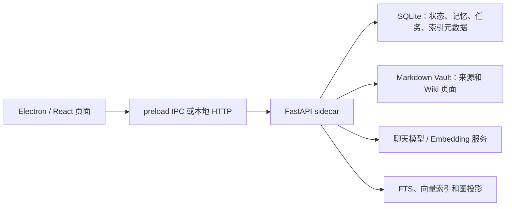
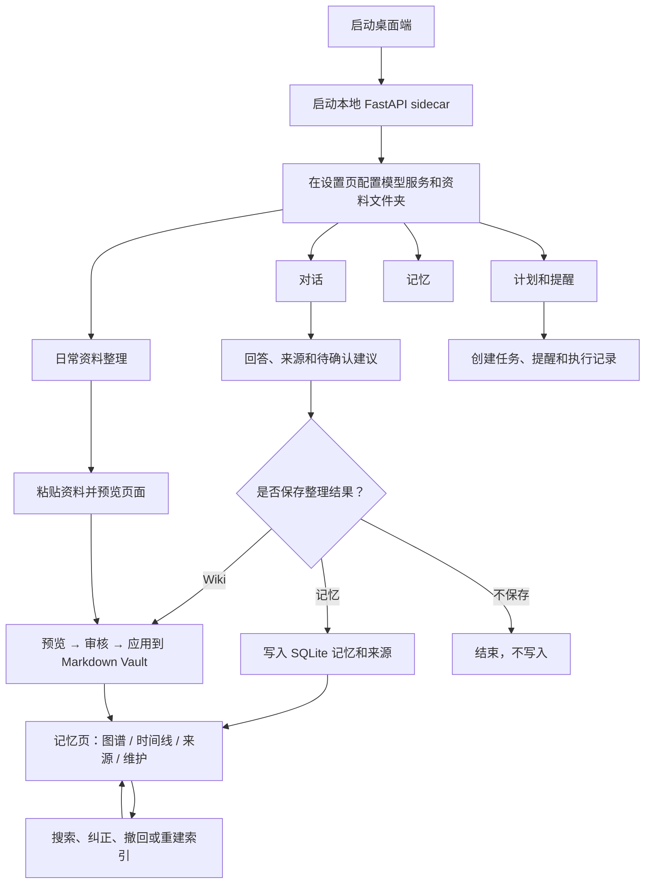
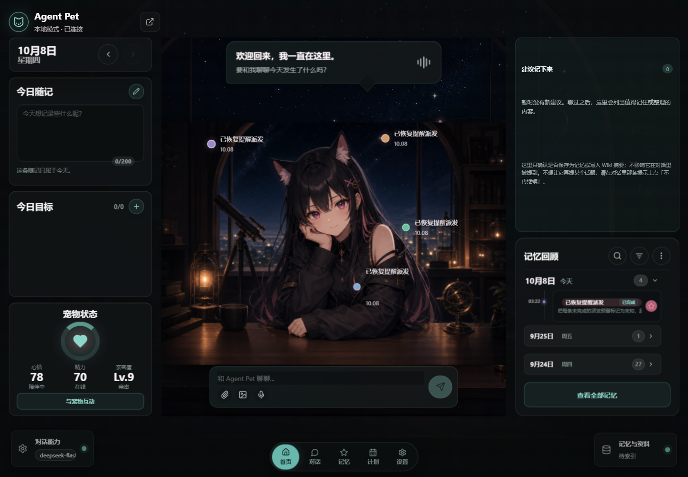
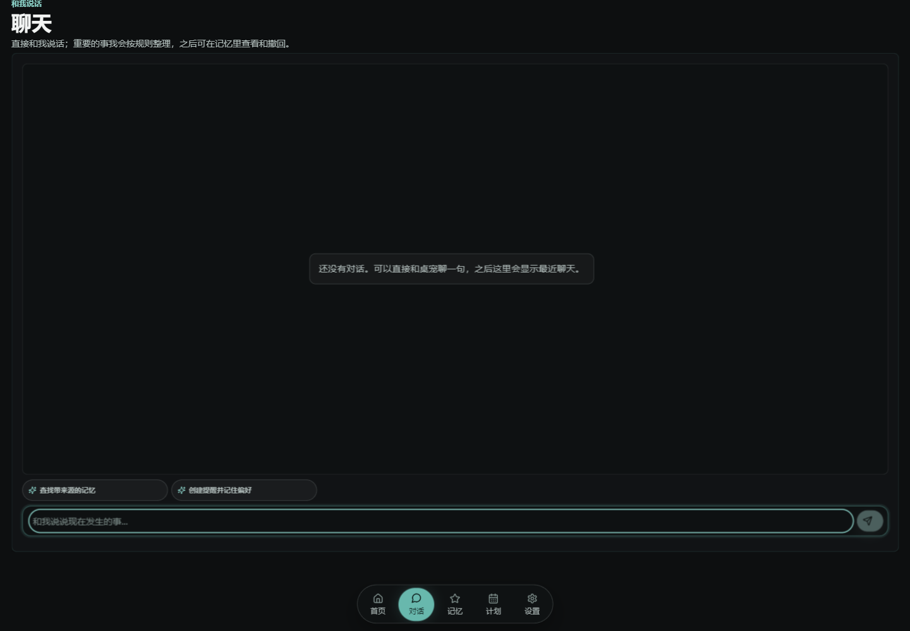
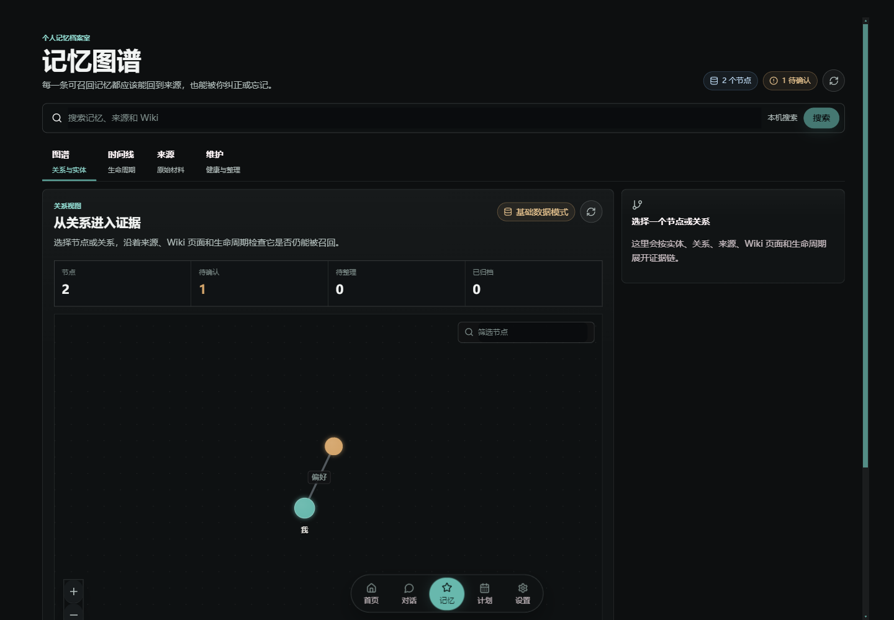
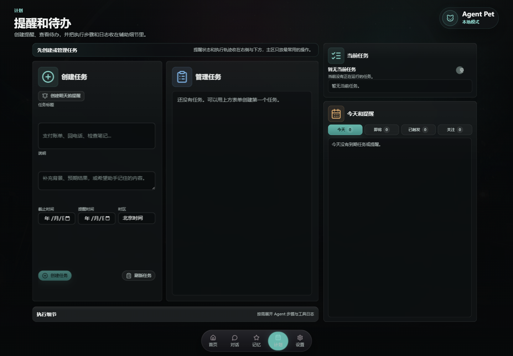
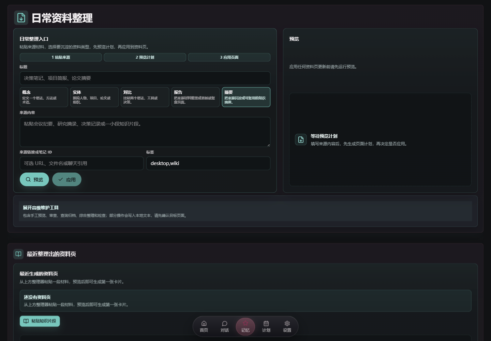
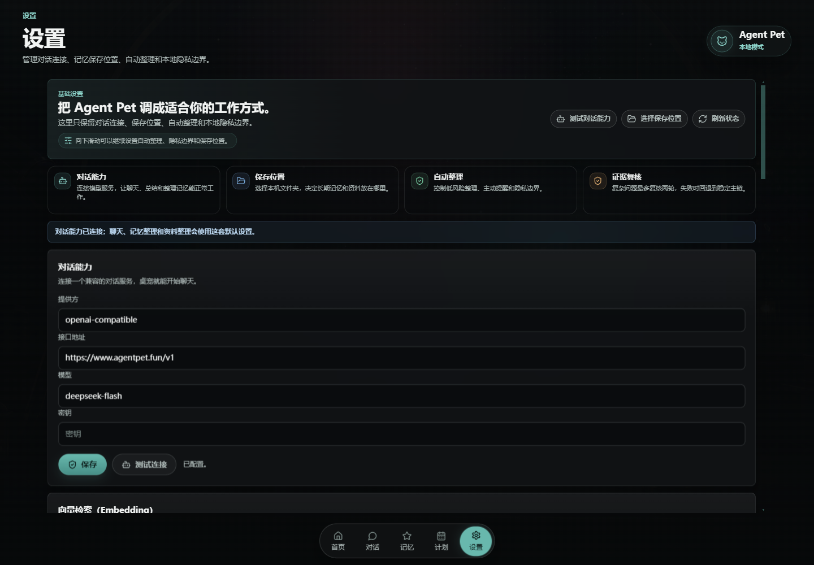

# Agent Pet

Agent Pet 是一款 Windows 桌面程序。桌面端使用 Electron 和 React，后端以 FastAPI sidecar 运行。当前项目包含聊天、记忆、资料整理、Wiki、任务和提醒页面。

程序面向单个 Windows 用户，不提供云同步或多人协作。模型服务在设置页配置；配置外部聊天模型或嵌入服务后，相应请求会发送到所填服务。

## 运行结构


```mermaid
flowchart LR
    UI["Electron / React 页面"] --> Bridge["preload IPC 或本地 HTTP"]
    Bridge --> Sidecar["FastAPI sidecar"]
    Sidecar --> SQLite["SQLite：状态、记忆、任务、索引元数据"]
    Sidecar --> Vault["Markdown Vault：来源和 Wiki 页面"]
    Sidecar --> Model["聊天模型 / Embedding 服务"]
    Sidecar --> Retrieval["FTS、向量索引和图投影"]
```

Electron 负责窗口、托盘、通知和 sidecar 生命周期；FastAPI sidecar 负责 API、数据读写和检索。SQLite 是运行状态的权威来源，Markdown Vault 保存可直接查看的资料和 Wiki 页面。

## 使用流程


```mermaid
flowchart TD
    Start["启动桌面端"] --> Sidecar["启动本地 FastAPI sidecar"]
    Sidecar --> Configure["在设置页配置模型服务和资料文件夹"]

    Configure --> Chat["对话"]
    Configure --> Import["日常资料整理"]
    Configure --> Tasks["计划和提醒"]
    Configure --> Memory["记忆"]

    Chat --> Answer["回答、来源和待确认建议"]
    Answer --> Save{"是否保存整理结果？"}
    Save -- "记忆" --> MemoryStore["写入 SQLite 记忆和来源"]
    Save -- "Wiki" --> WikiReview["预览 → 审核 → 应用到 Markdown Vault"]
    Save -- "不保存" --> Done["结束，不写入"]

    Import --> ImportPreview["粘贴资料并预览页面"]
    ImportPreview --> WikiReview
    Tasks --> TaskStore["创建任务、提醒和执行记录"]

    MemoryStore --> Review["记忆页：图谱 / 时间线 / 来源 / 维护"]
    WikiReview --> Review
    Review --> Maintain["搜索、纠正、撤回或重建索引"]
    Maintain --> Review
```

## 页面入口

| 页面 | 开发地址中的 hash | 用途 |
| --- | --- | --- |
| 首页 | `#stage` | 今日随记、今日目标、宠物状态和记忆回顾 |
| 对话 | `#chat` | 与模型对话，查看对话中的整理建议 |
| 记忆 | `#memory` | 查看图谱、时间线、来源和维护状态 |
| 计划 | `#agent` | 创建任务、设置提醒、查看执行步骤和日志 |
| 日常资料整理 | `#world` | 粘贴资料，预览并应用 Wiki 页面 |
| 设置 | `#settings` | 配置模型、Embedding、资料文件夹和自动整理 |

## 页面演示

### 首页



### 对话



### 记忆



### 计划



### 日常资料整理



### 设置



## 开发环境

- Windows 10/11 x64
- Python 3.10（后端锁文件针对 Windows x64）
- Node.js 20 和 npm

## 本地运行

以下代码块分别从仓库根目录开始，在 PowerShell 中执行。

### 安装后端依赖

```powershell
cd apps\backend
py -3.10 -m venv .venv
.\.venv\Scripts\python.exe -m pip install --no-deps -r requirements-win-py310.lock
.\.venv\Scripts\python.exe -m pip install --no-deps --no-build-isolation -e ".[packaging,vector,local-vector]"
.\.venv\Scripts\python.exe -m pip check
```

### 可选：下载本地模型

如果要使用内置的嵌入或重排模型，在仓库根目录运行对应脚本。文件下载到 `apps\backend\models`，不会提交到 Git。

```powershell
.\scripts\download-embedding-model.ps1
.\scripts\download-reranker-model.ps1
```

### 启动桌面端

```powershell
cd apps\desktop
npm ci
npm run dev
```

启动后，在设置页填写模型服务地址、模型名称和 API Key。开发模式下，后端默认使用 `apps\backend\.venv` 中的 Python；需要覆盖时可设置 `AGENT_PET_PYTHON`。

## 配置与本地数据

- Windows 上，API Key 使用当前用户的 DPAPI 加密保存。
- 默认 SQLite 数据库为 `%LOCALAPPDATA%\AgentPet\agent_pet.sqlite3`。可用 `AGENT_PET_DATA_DIR` 或 `AGENT_PET_SQLITE_PATH` 覆盖目录或数据库路径。
- 本地数据库不代表模型调用完全离线。配置外部聊天模型或嵌入服务时，相应请求会发送到所填服务。

## 测试与构建

从仓库根目录运行后端测试：

```powershell
apps\backend\.venv\Scripts\python.exe -m pytest apps/backend/tests -q
```

安装过桌面端依赖后，从仓库根目录运行静态检查：

```powershell
cd apps\desktop
npm run typecheck
```

需要构建前端时，在 `apps\desktop` 目录运行 `npm run build`。它会先执行 `typecheck`，再构建前端。

## 构建 Windows ZIP

先按上文安装后端依赖。若要把本地模型放进发布包，先运行两个模型下载脚本。然后从仓库根目录执行：

```powershell
cd apps\desktop
npm ci
npm run package:win
```

ZIP 输出到 `apps\desktop\release`。模型目录完整时，sidecar 构建会校验文件后复制到发布包；模型目录不存在时会提示并继续构建。需要未压缩目录包时运行 `npm run package:win:dir`。

## 目录

- `apps/backend`：FastAPI 后端、SQLite 存储和测试
- `apps/desktop`：Electron 主进程和 React 界面
- `scripts`：模型下载与 sidecar 构建脚本
- `docs/images`：README 页面演示图
- `docs/wiki-compilation.md`：Wiki 编译流程
